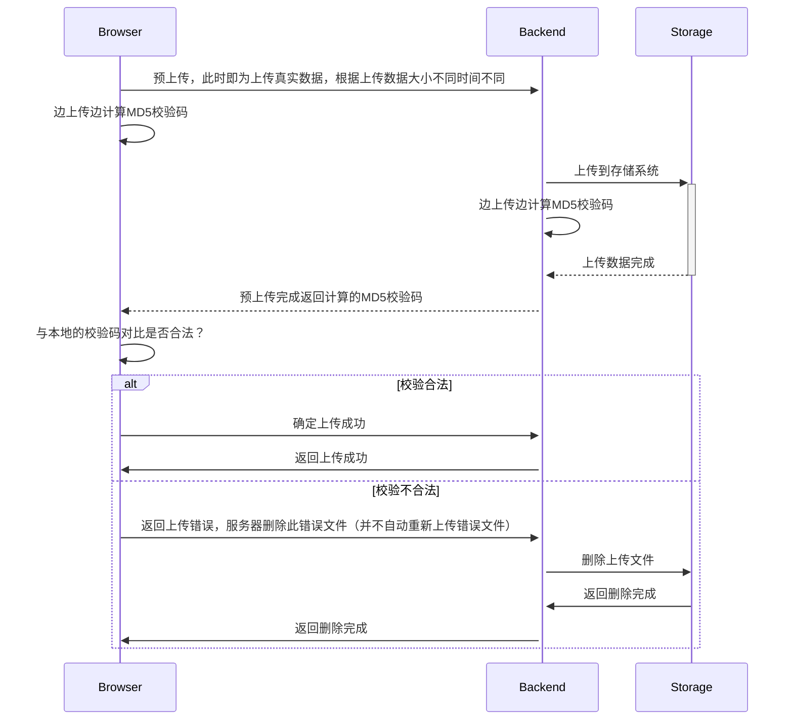
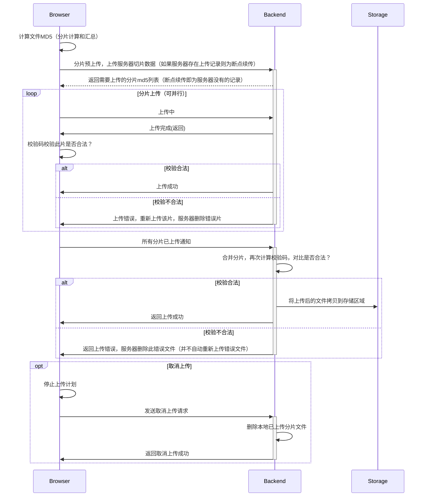
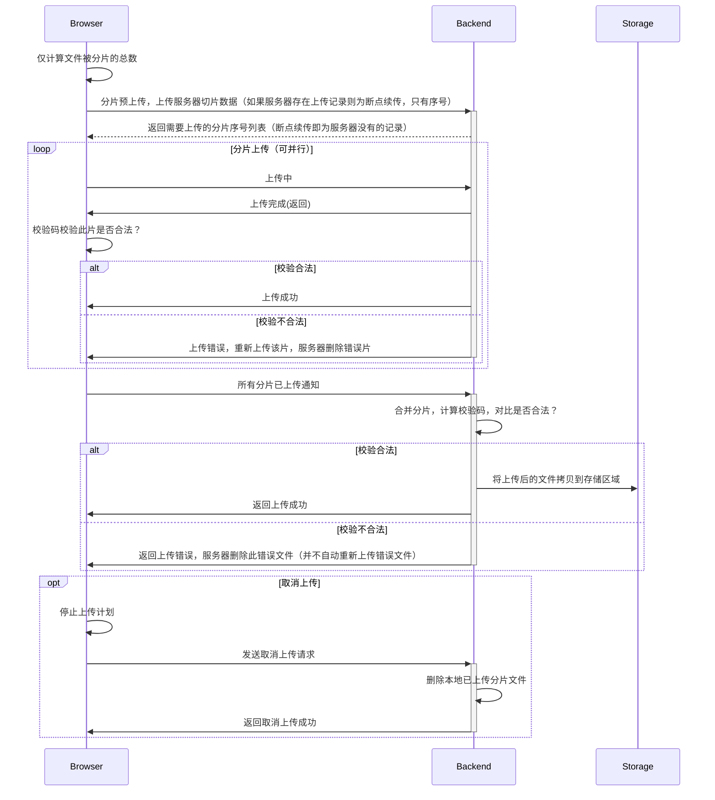

相信绝大多数”网上邻居“都体验过各种上传功能，不论是图片上传还是视频上传，其实都可以归类为文件上传，在HTTP层面就是发送http请求，在网际层就是TCP发送数据而已，与SSH上传、FTP上传原理都差不多，这里介绍一般上传的思路。
<!-- more -->

## 我们要做什么？

上传，在互联网中早已司空见惯的功能，简单来说就是把你本地的数据放到远端的服务器上去，在如今的互联网中，此功能的实现方法不胜枚举，整个流程可以简化为


从上图可以看出来，有三处需要传输数据，分别是：文件系统 --> 你的浏览器、你的浏览器 --> 服务器进程、服务器进程 --> 服务器存储。这里将讨论两种上传方式，比较他们的优缺点，并尝试提出各个传输数据部分优化思路，并结合文件校验来讨论在不同情况下的校验思路。

## 整块文件上传

### 上传分析

单个文件上传应该是互联网中被支持的最多的上传功能，各种框架、协议都支持的很完善。

#### 文件系统 --> 你的浏览器

大多数本地文件系统上传到浏览器的情况下，系统不会跑满磁盘的IO。特别是在民用网络中，即便是机械硬盘的读取速度也要比网络速度快。但是这条不绝对，一般机械硬盘的平均读写速度是几十上百兆字节每秒，万兆以太网的情况下磁盘IO确实是瓶颈。当然，要是本地文件系统是一些比较老的设备或者一些可移动存储，也可能导致磁盘IO为瓶颈。

如果真的遇到磁盘IO的瓶颈，一般有两种优化思路：


更换硬件可能是最简单的方法，也往往是立竿见影的方式，存储介质读写速度可能相差几十上百倍：




但是不同的存储介质价格也相差很大，还有存储数据丢失、寿命的问题，存储并不单单只看速度：








还有一种方式，是在存储方式上面花心思。当我们将存储数据以条带（striping）的方式，分布在多个磁盘存储，我们就能同时使用这些磁盘的读写能力，从而达到提升磁盘读写性能的目的，这就是[数据条带化（Data striping）](https://en.wikipedia.org/wiki/Data_striping)，大名鼎鼎的[RAID（redundant array of independent disks）](https://en.wikipedia.org/wiki/RAID)就是基于这种原理。







总的来说硬盘的提升是很有效果的，但是要考虑到实际情况，不同硬盘的售价相差很大，考虑预算、规模一系列问题后，多数情况下，不会直接更换硬盘。而且目前在互联网中传输的性能瓶颈不在硬盘中。

#### 你的浏览器 --> 服务器进程

浏览器到服务器进程这一段过程要复杂的多，主要是互联网存在太多不确定的因素，不过还好基于[TCP（Transmission Control Protocol）](https://en.wikipedia.org/wiki/Transmission_Control_Protocol)的HTTP协议保证了传输的可靠性，[TLS（Transport Layer Security）](https://en.wikipedia.org/wiki/Transport_Layer_Security)还可以保证我们的数据的安全性和完整性，很大的提升了我们开发上传服务的便利。

HTTP协议中我们一般使用[POST](https://en.wikipedia.org/wiki/POST_(HTTP))方法来上传数据，POST语法合适，且方便携带数据，我们在request body中使用form-data的数据上传，浏览器HTML如下：

```html
<div class="item" id="upload1">
    <div class="title">单文件上传FORM-DATA</div>
    <input type="file" class="upload-inp">
    <button class="upload-btn upload">选择并上传</button>
    <div class="list">
        <span class="files"></span>
        <div class="progress">
            <div class="cur-pro">
            </div>
        </div>
        <span class="pro-val"></span>
        
    </div>
</div>
```

js代码我不太熟悉，这个demo也是网上找代码修改的。主要是增加浏览器进度条显示：

```javascript
(function () {
    let upload1 = document.querySelector("#upload1"),
        upload_inp = upload1.querySelector('.upload-inp'),
        upload_upload = upload1.querySelector('.upload-btn'),
        sel_files = upload1.querySelector('.files'),
        file1 = upload1.querySelector('.abbr'),
        cur_pro = upload1.querySelector('.cur-pro'),
        pro_val = upload1.querySelector('.pro-val'),
        progress = upload1.querySelector('.progress');


    upload_upload.addEventListener('click', function () {
        upload_inp.click();
    });

    upload_inp.addEventListener('change', async function () {
        let file = this.files[0];
        sel_files.innerHTML = file.name;
        progress.style.display = 'inline-block';
        pro_val.innerHTML = '';
        let formData = new FormData();
        formData.append('file', file);
        request.post('/files/precreate', formData, {
            onUploadProgress: function (ev) {
                let pro = ((ev.loaded / ev.total) * 99).toFixed(0) + '%';
                cur_pro.style.width = pro;
                pro_val.innerHTML = pro;
            },
            params: {
                "lastmtime": file.lastModified,
                "size": file.size,
                "name": file.name,
                "parent": dir_str,
            }
        }).then(res => {
            console.log(res);
            res = res["val"]
            cur_pro.style.width = "99.99%";
            pro_val.innerHTML = "99.99%";
            const json = JSON.stringify(
                {
                    name: res["name"],
                    parent: dir_str,
                    uploadId: res["uploadId"],
                }
            );
            request.post('/files/create', json, {
                headers: {
                    'Content-Type': 'application/json'
                }
            }).then(res => {
                cur_pro.style.width = '100%';
                pro_val.innerHTML = '100%';
                location.reload();
            }).catch(err => {
                console.log(err);
            });
        }).catch(err => {
            console.log(err);
        });
    });
})();
```

效果如下：





#### 服务器进程 --> 服务器存储

服务器进程到服务器存储这部分，我实现了两种方式，一种是本地存储，一种是s3对象存储。

本地存储优点不必多说。简单、方便、有效能帮助我们快速建立存储系统，但是扩展性差，在大规模应用的时候不见得好用。

s3对象存储的难度就要高一些，还要考虑到服务器转发能力。这里的实现方法我觉得应该是直接将流上传到s3对象存储，尽量避免本地落盘，浪费额外的空间和时间。

### 校验分析

这里其实还做了一些校验，用的算法时MD5，但是在不影响传输性能的情况下进行的，浏览器上传时会边上传边计算MD5，而服务器进程会在保存时计算MD5，当服务器返回给浏览器MD5不一致时，浏览器会发送删除请求。

### 上传流程



## 切片文件上传

整块文件上传的确方便，易于实现，但是当TCP连接因为网络断开，或者TLS连接因为安全问题断开，想要恢复连接非常困难，这时不得不放弃之前传输的数据，从头开始传输。而且WEB服务器一般有上传数据的大小限制，当然这个数据可以调，但是还是可能会不方便。

另一种可行的方式可以解决上述问题，这种方式就是切片上传。

### 上传分析

我们将一个比较大的文件切片为小份，到服务器后再把它们组合起来，这就是切片上传的整体思路。

#### 文件系统 --> 你的浏览器

文件系统到浏览器端如果硬盘已经到达性能瓶颈，这种方式并不会增加读取速度，相反，或许还对读取速度有一些负面的影响（比如延迟增高，但是影响很小）。但是当硬盘性能未达到瓶颈时，这种方式就能多线程读取，充分利用磁盘性能。

大概的上传代码：

```js
(async function () {
    let upload4 = document.querySelector("#upload4"),
        upload_inp = upload4.querySelector('.upload-inp'),
        upload_upload = upload4.querySelector('.upload-btn'),
        sel_files = upload4.querySelector('.files'),
        cur_pro = upload4.querySelector('.cur-pro'),
        pro_val = upload4.querySelector('.pro-val'),
        progress = upload4.querySelector('.progress');

    upload_upload.addEventListener('click', function () {
        upload_inp.click();
    });

    upload_inp.addEventListener('change', async function () {
        console.log(this)
        let file = this.files[0];


        let maxSize = 4 * 1024 * 1024; // 4MiB
        let count = Math.ceil(file.size / maxSize);

        const json = JSON.stringify(
            {
                name: file.name,
                size: file.size,
                part_num: count,
                part_size: maxSize,
                parent: dir_str,
            }
        );

        console.log("precreate")
        let precreateRes = await request.post('/files/parts/precreate', json, {
            headers: {
                'Content-Type': 'application/json'
            }
        })
        precreateRes = precreateRes["val"]
        const currentindexlist = new Set(precreateRes["current"]);

        progress.style.display = 'inline-block';
        cur_pro.style.width = '0%';
        pro_val.innerHTML = '0%';

        let complete = currentindexlist.size;

        let total = count
        if (!precreateRes["meta"]["upload_id"]) {
            cur_pro.style.width = "100%";
            pro_val.innerHTML = "100%";
        }

        console.log("upload")
        const uploadId = precreateRes["meta"]["upload_id"]
        const sleep = ms => new Promise(r => setTimeout(r, ms));
        let requestsMax = 5
        const hashAndUpload = function retriveHash() {
            return new Promise((resolve, reject) => {
                let spark = new SparkMD5.ArrayBuffer();
                let fr = new FileReader();
                // fr.readAsArrayBuffer(file);
                let currentChunk = 0;
                let nextSlice;

                function loadNext() {
                    const start = currentChunk * maxSize;
                    const end = start + maxSize >= file.size ? file.size : start + maxSize;
                    let s = file.slice(start, end)
                    fr.readAsArrayBuffer(s);
                    return s
                }

                fr.onload = (ev) => {
                    if (!currentindexlist.has(currentChunk)) {
                        spark.append(ev.target.result);
                        let tm1 = new SparkMD5.ArrayBuffer();
                        tm1.append(ev.target.result)
                        let h = tm1.end()
                        tm1.destroy()
                        while (requestsMax <= 0) {
                            sleep(100)
                        }
                        requestsMax--
                        let formData = new FormData();
                        formData.append('file', nextSlice);
                        request.post('/files/parts/upload', formData, {
                            params: {
                                "upload_id": uploadId,
                                "part": currentChunk,
                                "name": file.name,
                                "parent": dir_str,
                            }
                        }).then(res => {
                            console.log(h + " : " + res);
                            res = res["val"]
                            if (h === res) {
                                requestsMax++
                                complete++;
                                let progersss = (complete / count * 100).toFixed(2) + '%';
                                cur_pro.style.width = progersss;
                                pro_val.innerHTML = progersss;
                                console.log(res);
                                console.log(complete + " : " + count)
                                if (complete >= count) {
                                    let hash = spark.end();
                                    spark.destroy()
                                    cur_pro.style.width = '99.99%';
                                    pro_val.innerHTML = '99.99%';
                                    setTimeout(() => {
                                        request.post('/files/parts/create', JSON.stringify(
                                            {
                                                md5: hash,
                                                name: file.name,
                                                parent: dir_str,
                                                upload_id: uploadId,
                                                lastmtime: file.lastModified,
                                                size: file.size,
                                            }
                                        ), {
                                            headers: {
                                                'Content-Type': 'application/json'
                                            }
                                        }).then(res => {
                                            console.log(hash + ":" + res["val"]);
                                            cur_pro.style.width = '100%';
                                            pro_val.innerHTML = '100%';
                                            location.reload();
                                        }).catch(err => {
                                            console.log(err);
                                        });
                                    }, 3000);
                                }
                            }
                            // alert('上传成功了');
                        }).catch(err => {
                            console.log(err);
                        });
                    }
                    currentChunk++
                    if (currentChunk < count) {
                        nextSlice = loadNext();
                    }
                };
                console.log("reading...")
                nextSlice = loadNext();
            });
        }
        await hashAndUpload()
    });
})()
```

#### 你的浏览器 --> 服务器进程

浏览器到服务器进程将提升更多，多个HTTP请求或许能充分利用网络带宽，当然，如果带宽达到上限，提升也很有限，但是每次上传都传输一部分数据，为断点续传提供能应用端的实现方法。

#### 服务器进程 --> 服务器存储

此部分稍微有点麻烦，因为它不能像第一种方式那样直接保存得存储端，它需要在本地存储（如果内存够大，内存也可以），上传完成后将整个数据组合起来再上传到存储系统。

### 校验分析

本部分还是用MD5校验，而且每个小块都要计算校验码，合并之后在计算一次校验码。

### 上传流程

本部分我尝试了两个检验流程。

1、先计算HASH在进行上传：



这种方式在上传之前得计算MD5太慢，根据文件上传的大小不同，计算MD5的时间也不同，这一块不是很友好，在上传之前要等很久才上传。这里可以使用worker库利用多线程计算MD5，但是我没有尝试。

2、边上传边计算MD5



这种方式的好处就是在上传的时候计算MD5保证数据可以直接上传，但是由于我们的前端代码不熟悉，这一块有BUG，老是上传到一半，浏览器卡住。而且这种方法在服务器进程保存的时候会比较慢因为本地要组合在保存。

效果如下：




## 总结

简单总结下，第一种其实是我们最常用的，去点就是只能完整上传整个文件，比较适合小文件。第二种分片上传，我思考了百度网盘上传的思路实现的，实现比较困难，但是在性能、通用性上来说更有价值。
