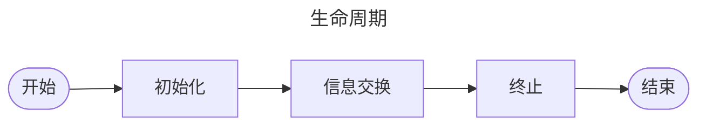
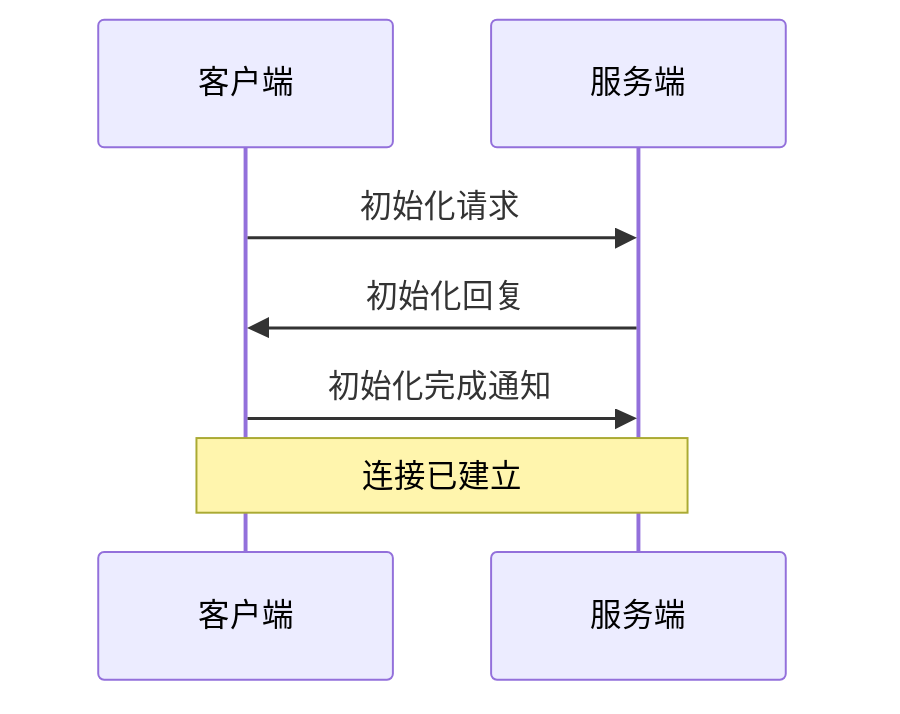

Model Context Protocol（MCP）是一个标准化协议，旨在简化客户端与服务器间的资源管理、动态提示交互及通信。
<!-- more -->

## 简介

MCP是24年底才被提出来的一项新协议，主要是对AI的外部方法调用的一种补充。官方分别设计了两种数据传输方式——stdio和sse（服务器事件），大模型时代大家仿佛对sse过多的吹捧，所以MCP也倾向于使用sse，不过笔者在这里有不同看法，传统的全双工的websocket也有对应优势，后续有空单独开一篇文章说说。

### 摘要 

本篇文章的主要在介绍MCP，以下是其主要结构：


支持文本（UTF-8编码）与二进制（Base64编码）资源，通过URI（如file:///report.pdf）唯一标识。客户端可通过静态列表（resources/list）或动态模板发现资源，并订阅实时更新（如内容变更通知）





提供可复用的交互模板，支持参数化（如编程语言、时间范围）。客户端通过prompts/get调用提示，并嵌入动态资源（如日志、代码文件），服务端返回结构化内容（含文本或资源引用）。





基于JSON-RPC 2.0，支持请求、响应、通知三种消息类型，内置stdio（本地工具）和SSE（流式传输）等通信方式，允许自定义传输实现。连接生命周期涵盖初始化（版本协商）、信息交换（请求-响应/通知）及终止流程。




## 资源

### 资源定义

MCP在资源方面类似于RESTful的定义，有助于客户端发现并读取用户资源。

### 资源类型

资源可以包含**两种**类型的内容：


以**UTF-8** 编码的文本数据：源代码、配置文件、日志文件、JSON/XML、纯文本等。






以**base64**编码的原始二进制数据：图片、PDF、音频文件、视频文件、其他非文本格式。



### 资源URI

资源使用遵循`[protocol]://[host]/[path]`格式的URI来标识。例如
```
`file:///home/user/documents/report.pdf` 
`postgres://database/customers/schema`    
`screen://localhost/display1`     
```


**协议**和**路径结构**由 MCP 服务器实现定义。服务器可以定义自己的自定义 URI 方案。

### 资源发现

**客户端**可以通过**两种**主要方法发现可用资源：**直接资源**和**资源模板**。

#### 直接资源

服务器通过`resources/list`端点公开具体资源的列表，每个资源格式：

```json 资源定义格式
{
  uri: string;           // Unique identifier for the resource
  name: string;          // Human-readable name
  description?: string;  // Optional description
  mimeType?: string;     // Optional MIME type
}
```


#### 资源模板

对于动态资源，服务器可以公开**URI模板**，客户端可以使用它来构建有效资源URI：

```json 动态资源模板定义格式
{
  uriTemplate: string;   // URI template following RFC 6570
  name: string;          // Human-readable name for this type
  description?: string;  // Optional description
  mimeType?: string;     // Optional MIME type for all matching resources
}
```

### 读取资源

要读取资源，客户端需要使用资源 URI 发出`resources/read`请求。

服务器以资源内容列表进行响应：

```json 服务器资源响应定义格式
{
  contents: [
    {
      uri: string;        // The URI of the resource
      mimeType?: string;  // Optional MIME type

      // One of:
      text?: string;      // For text resources
      blob?: string;      // For binary resources (base64 encoded)
    }
  ]
}
```

### 资源更新

MCP通过**两种机制**实现资源的实时更新功能：**列出更改**和**内容变更**

#### 列出更改

当可用**资源列表**（内容数量）发生变化时，服务器可以通过`notifications/resources/list_changed`通知通知客户端。

#### 内容变更

客户可以订阅特定的资源更新：

1. 客户端使用资源 URI 发送`resources/subscribe`
2. 当资源发生变化时，服务器发送`notifications/resources/updated`
3. 客户端可以使用`resources/read`获取最新内容
4. 客户端可以使用`resources/unsubscribe`取消订阅

### 资源最佳实践



## Prompt

MCP可以创建可以重复使用的Prompt和工作流程。

### Prompt结构

```json title="每个Prompt结构如下："
{
  name: string;              // Unique identifier for the prompt
  description?: string;      // Human-readable description
  arguments?: [              // Optional list of arguments
    {
      name: string;          // Argument identifier
      description?: string;  // Argument description
      required?: boolean;    // Whether argument is required
    }
  ]
}
```


### 发现提示

客户端可以通过`prompt/list` 发现可用提示：

```json title="发现提示"
// Request
{
  method: "prompts/list"
}

// Response
{
  prompts: [
    {
      name: "analyze-code",
      description: "Analyze code for potential improvements",
      arguments: [
        {
          name: "language",
          description: "Programming language",
          required: true
        }
      ]
    }
  ]
}
```


### 使用提示

要使用提示，客户端需要发出 `prompts/get` 请求：

```json 
// Request
{
  method: "prompts/get",
  params: {
    name: "analyze-code",
    arguments: {
      language: "python"
    }
  }
}

// Response
{
  description: "Analyze Python code for potential improvements",
  messages: [
    {
      role: "user",
      content: {
        type: "text",
        text: "Please analyze the following Python code for potential improvements:\n\n```python\ndef calculate_sum(numbers):\n    total = 0\n    for num in numbers:\n        total = total + num\n    return total\n\nresult = calculate_sum([1, 2, 3, 4, 5])\nprint(result)\n```"
      }
    }
  ]
}
```


### 动态提示

提示可以是动态的，包括：

#### 嵌入资源上下文

```json 
{
  "name": "analyze-project",
  "description": "Analyze project logs and code",
  "arguments": [
    {
      "name": "timeframe",
      "description": "Time period to analyze logs",
      "required": true
    },
    {
      "name": "fileUri",
      "description": "URI of code file to review",
      "required": true
    }
  ]
}
```


处理`prompts/get`请求时：

```json 
{
  "messages": [
    {
      "role": "user",
      "content": {
        "type": "text",
        "text": "Analyze these system logs and the code file for any issues:"
      }
    },
    {
      "role": "user",
      "content": {
        "type": "resource",
        "resource": {
          "uri": "logs://recent?timeframe=1h",
          "text": "[2024-03-14 15:32:11] ERROR: Connection timeout in network.py:127\n[2024-03-14 15:32:15] WARN: Retrying connection (attempt 2/3)\n[2024-03-14 15:32:20] ERROR: Max retries exceeded",
          "mimeType": "text/plain"
        }
      }
    },
    {
      "role": "user",
      "content": {
        "type": "resource",
        "resource": {
          "uri": "file:///path/to/code.py",
          "text": "def connect_to_service(timeout=30):\n    retries = 3\n    for attempt in range(retries):\n        try:\n            return establish_connection(timeout)\n        except TimeoutError:\n            if attempt == retries - 1:\n                raise\n            time.sleep(5)\n\ndef establish_connection(timeout):\n    # Connection implementation\n    pass",
          "mimeType": "text/x-python"
        }
      }
    }
  ]
}
```


## 通信协议

### 消息格式

MCP使用**JSON-RPC 2.0** 作为其传输格式。传输层负责将 MCP 协议消息转换为 **JSON-RPC** 格式进行传输，并将收到的\*\* JSON-RPC\*\* 消息转换回 MCP 协议消息。使用的 **JSON-RPC** 消息有三种类型：

#### 请求

```json 请求格式
{
  jsonrpc: "2.0",
  id: number | string,
  method: string,
  params?: object
}
```


#### 响应

```json 响应格式
{
  jsonrpc: "2.0",
  id: number | string,
  result?: object,
  error?: {
    code: number,
    message: string,
    data?: unknown
  }
}
```


#### 通知

```json 通知格式
{
  jsonrpc: "2.0",
  method: string,
  params?: object
}
```


### 错误处理

MCP 定义了以下标准错误代码：

```typescript MCP错误代码
enum ErrorCode {
  // Standard JSON-RPC error codes
  ParseError = -32700,
  InvalidRequest = -32600,
  MethodNotFound = -32601,
  InvalidParams = -32602,
  InternalError = -32603
}
```


SDK 和应用程序可以定义自己的 -32000 以上的错误代码。

错误通过以下方式传播：

- 请求的错误响应
- 传输中的错误事件
- 协议级错误处理程序

### 内置传输类型

#### 标准输入/输出 (stdio)

> 🧷stdio 传输支持通过标准输入和输出流进行通信。这对于**本地集成**和**命令行工具**特别有用。

{% link Transports - Model Context Protocol Learn about MCP's communication mechanisms::https://modelcontextprotocol.io/docs/concepts/transports#standard-input%2Foutput-stdio::https://mintlify.s3.us-west-1.amazonaws.com/mcp/logo/light.svg %}

#### 服务器发送事件 (SSE)

> 🧷SSE 传输通过 `HTTP POST` 请求实现服务器到客户端的流式传输，从而实现客户端到服务器的通信。



### 自定义传输

> 🧷MCP 可以轻松实现满足特定需求的自定义传输。任何传输实现只需符合 Transport 接口



### 连接生命周期




#### 1.初始化




1. 客户端发送带有协议版本和功能`initialize`请求
2. 服务器以其协议版本和功能进行响应
3. 客户端发送`initialized`通知作为确认
4. 开始正常信息交换

#### 2.信息交换

初始化后，支持以下模式：

- **请求-响应**：客户端或服务器发送请求，对方响应
- **通知**：任何一方发送单向消息

#### 3.终止

任何一方都可以终止连接：

- 通过`close()`彻底关闭
- 传输断开
- 错误情况
